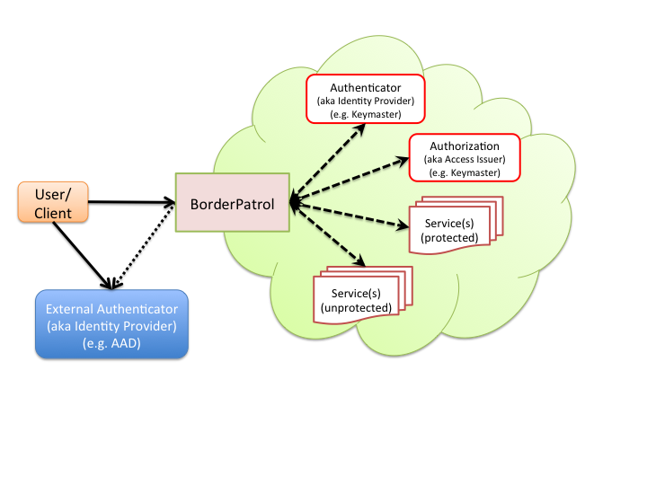

# BorderPatrol

Border Patrol is a type-safe, immutable, functional Scala library built on top of [Finagle](https://finagle.github.io/)
that provides modular components useful for session management and authentication. This library is used at
[Lookout](http://lookout.com) for single sign on with support for multiple authentication backends.



The original version (as a server) can be found here (nginx+lua): [ngx_borderpatrol](https://www.github.com/lookout/ngx_borderpatrol)

Badges
------

[](https://gitter.im/lookout/borderpatrol?utm_source=badge&utm_medium=badge&utm_campaign=pr-badge&utm_content=badge)
[](https://travis-ci.org/lookout/borderpatrol)
[](https://codecov.io/github/lookout/borderpatrol)

Modules
-------

Border Patrol uses a multi-project structure and contains the following _modules_:

* [`core`](core) - the core classes/functions
* [`auth`](auth) - different authentication plugins for core auth
* [`security`](security) - different security plugins, e.g. CSRF protection
* [`server`](server) - a server composing these modules that can be configured
* [`example`](example) - the demo app showing sessions and authentication for multiple
services. It mocks the authentication (aka identity provider), authorization (aka access issuer) and upstream endpoints.

Installation
------------

Every stable Border Patrol module is published at Bintray. The SNAPSHOT builds are published to JFrog.

* _stable_ release:

```scala
libraryDependencies ++= Seq(
  "com.lookout.borderpatrol" %% "[borderpatrol-module]" % "0.1.0"
)
```

* `SNAPSHOT` release:

```scala
libraryDependencies ++= Seq(
  "com.lookout.borderpatrol" %% "[borderpatrol-module]" % "0.1.18-SNAPSHOT"
)
```

Building Border Patrol
----------------------

To build Border Patrol you should have [sbt](http://www.scala-sbt.org/0.13/tutorial/Setup.html)
installed (prefer v0.13.8+). Run `sbt`, and then use any of the following commands:

 * `compile`: compile the code
 * `project [project]`: to switch projects, e.g. "project example"
 * `console`: launch a REPL
 * `test`: run the tests
 * `unidoc`: generate the documentation
 * `scalastyle`: run the style-checker on the code
 * `validate`: run tests, style-checker, and doc generation


Border Patrol Concepts
----------------------

 * The Border Patrol fronts all services (configured using `ServiceIdentifier`) in a Cloud.
 * The Cloud is identified by one or more subdomains (configured using `CustomerIdentifier`)
 * The Cloud has an identity `manager` (for authentication) and access `manager` (for authorization).
 * The identity manager, access manager, subdomains and default service forms the policy, which is defined using
`LoginManager`.
 * When a HTTP request with URL `<http[s]>://<subdomain>:[port]/<path-prefix>` hits BorderPatrol:
   * Looks up the CustomerIdentifier using subdomain prefix. It returns 404, if no match is found.
   * Looks up the ServiceIdentifier using path prefix. In the absence of any path, the request is
redirected to the default service.

Border Patrol Components:
-------------------------

 * Service Identifier:
   * A service can be configured as protected (default) or unprotected.
   * Once authenticated, the user has access to all the protected services in the Cloud
   * The user (authenticated or not) has access to all the unprotected services in the Cloud
 * Identity Manager:
   * If external authentication (e.g. OAuth2) is used, then identity manager provisions the user in Cloud.
   * `keymaster` is a currently supported identity manager. It sends user credentials to an authentication service
in the Cloud. The authentication service responds with a Master Token.
   * The identity manager caches the Master Token in the Session.
   * The implementation is modular and new managers can easily be added
 * Access Manager:
   * `keymaster` is a currently supported access manager. It sends service name and Master Token to an authorization
service in the Cloud. The authorization service responds with a Service Token.
   * The access manager caches the Service Token in the Session.
   * The implementation is modular and new managers can easily be added
   * It relays Request w/ Service Token to the upstream endpoints, so that it can validate it.
 * Session Store:
   * A store is used to cache information about a Session.
   * A SessionId (a signed id with an expiry) acts a key to the session. The SessionId is sent to the user as a cookie
in the HTTP response.
   * For unauthenticated user, the Session contains original Request
   * For authenticate user, the Session contains Master Token and one or more Service Token(s)
 * Secret Store:
   * A store is used to cache secret used to sign the session id(s)

Configuration
-------------

 * `secretStore`: Secret Store. It can be configured using `type` as `InMemorySecretStore` or `ConsulSecretStore`.
   * `InMemorySecretStore`: Typically used for single host setup as Secrets are meant to be shared across all the
BorderPatrol nodes
     ```json
     "secretStore" : {
       "type" : "InMemorySecretStore",
     }
     ```
   * `ConsulSecretStore`: Setting up Consul is outside of the scope.
     * `hosts`: A list of consul URLs (Format: `[<http[s]>://<host>:[port]]+`)
     * `key`: BorderPatrol uses the key-value store for storing the secret. The `key` is configurable.
     ```json
     "secretStore" : {
       "type" : "ConsulSecretStore",
       "hosts": ["http://localhost:8500"],
       "key": "BpSecrets"
     }
     ```
 * `sessionStore`: Session Store. It can be configured using `type` as `InMemoryStore` or `MemcachedStore`.
   * `InMemoryStore`: Typically used for single host setup as Sessions are meant to be shared across all the
BorderPatrol nodes.
     ```json
     "sessionStore" : {
       "type" : "InMemoryStore",
     }
     ```
   * `MemcachedStore`: Setting up Memcached is outside of the scope. BorderPatrol uses it to store Sessions.
     * `hosts`: A comma separated list of of memcached host and port (Format: `<host>:[port],<host>:[port]`)
     ```json
     "sessionStore" : {
       "type" : "MemcachedStore",
       "hosts" : "localhost:123,localhost:234"
     }
     ```
 * `accessManagers`: A list of ACCESS `Manager`s. An Access manager authorizes access for authenticated users to
 protected endpoints in the Cloud.
 * `identityManagers`: A list of IDENTITY `Manager`s. An Identity manager authenticates the user or provisions an
 externally authenticated user in the Cloud.
 * `Manager`:
   * `hosts`: A list of endpoint URLs (Format: `[<http[s]>://<host>:[port]]+`)
   * `path`: A path serviced by the authentication (aka Identity Provider) or authorization (aka Acces Issuer) endpoint.
   * `name`: A unique name that identifies this Manager
 * `loginManagers`: A list of LOGIN `Manager`s
 * `loginManager`: It defines policy items such as authentication backend, identity manager and access manager used
for the given CustomerIdentifier.
   * `name`:  unique name that identifies this Login Manager
   * `identityManager`: Identity manager name used by this Login Manager
   * `accessManager`: Access manager used by this Login Manager
   * `proto`: A protocol module that defines authentication backend used for
     * `loginConfirm`: The path at which `Internal` login form or external authenticator posts the login
credentials
     * `type`: The type of proto used. Currently supported types are `Internal` and `OAuth2Code`
     * `Internal` specific config:
       * `authorizePath`:
     * `OAuth2Code` specific config:
       * `authorizeUrl`: A URL to request an authorization code for access to a resource
       * `tokenUrl`: A URL to request access token using authorization code
       * `certificateUrl`: A URL to fetch certificate to verify token signature
       * `clientId`: Client id of the OAuth2 server application
       * `clientSecret`: Client secret of the OAuth2 server application
 * `serviceIdentifiers`: A list of service endpoints in the cloud.
 * `serviceIdentifier`: A service endpoint.
   * `hosts`: A list of service URLs (Format: `[<http[s]>://<host>:[port]]+`)
   * `name`: A unique name that identifies this Service. For protected services, the access issuer must be aware of
this service
   * `path`: A path serviced by the service endpoint
   * `rewritePath`: If configured, this path replaces the `path` in the incoming Request
   * `protected`: If the service is NOT protected, then it bypasses access issuer. The default is `true`.
 * `customerIdentifiers`: A list of customer identifiers.
 * `customerIdentifier`:
   * `loginManager`: Login Manager or policy used by this customer identifier
   * `subdomain`: A subdomain represented by this identifier
   * `defaultServiceIdentifier`: The default service for this customer identifier
 * `statdReporter`: The statsd reporter configuration
   * `host`: Upstream statsd endpoint
   * `durationInSec`: Reporting frequency in Seconds.
   * `prefix`: Prefix attached to each reported stat
 * `listeningPort`: Border Patrol listens to new requests on this port.
 * `healthCheckUrls`: External dependencies that impact the Border Patrol Health Status

Running the example
-------------------

* To test and work with subdomain routing locally, ensure to update your /etc/hosts file to include subdomains to
  localhost. For example:
  ```text
  127.0.0.1 ent.localhost
  ```

* Run
  ```text
  $ sbt
  > project example
  > run
  ```

Documentation
-------------

* Scaladoc is available at [http://lookout.github.io/borderpatrol/docs](http://hackers.lookout.com/borderpatrol/docs/#com.lookout.borderpatrol.package)
* Markdown documents are available [here](https://github.com/lookout/borderpatrol/tree/master/docs/src/main/tut).  The code examples are fully runnable in a Scala REPL verified with [tut](https://github.com/tpolecat/tut).  Use `sbt tut` to compile example code in markdown (`docs/src/main/tut`) which outputs to `target/scala-N.NN/tut`

Contributing
------------

We would love to make this better, so please help us!

* [Submit a PR](CONTRIBUTING.md) including an issue label ["easy"](https://github.com/lookout/borderpatrol/issues?q=is%3Aopen+is%3Aissue+label%3Aeasy)
* Write ScalaDoc comments
* Write tutorials and examples
* Improve tests
* Help with code review
* Give it a star
* Join us on IRC `#borderpatrol` on [Freenode](http://freenode.net)

License
-------

We use the MIT License [License](LICENSE)
